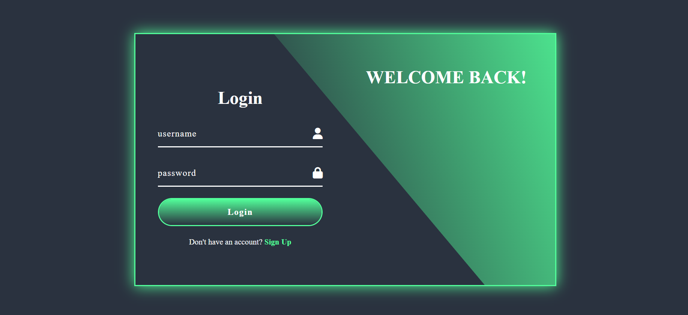

# Login & Sign Up Form with Slide Effect

**Login & Sign Up Form Slide Effect** est une application web moderne pour gérer l'accès utilisateur avec deux formulaires: **Login** et **Sign Up**.  
Le projet est développé avec **HTML, CSS et JavaScript pur** et inclut des animations fluides pour passer d'un formulaire à l'autre.

## Fonctionnalités
- Formulaire de **Login** avec champs Username et Password  
- Formulaire de **Sign Up** avec champs Username, Email et Password  
- Effet **slide animation** entre Login et Sign Up  
- Design moderne avec **formes courbées** et effets visuels attractifs  

## Installation
1. Télécharger ou cloner le projet sur votre ordinateur  
2. Ouvrir le fichier `index.html` dans votre navigateur préféré  

## Utilisation
1. Par défaut, le formulaire Login est affiché  
2. Pour créer un nouveau compte, cliquez sur **Sign Up** → le formulaire glisse vers la droite  
3. Pour revenir au Login, cliquez sur **Sign In** → le formulaire glisse vers la gauche  

<<<<<<< HEAD

## Screenshots

=======
## Structure du projet

>>>>>>> 2ecc3f761857f986c4f23698a1e72da1a82958ad
